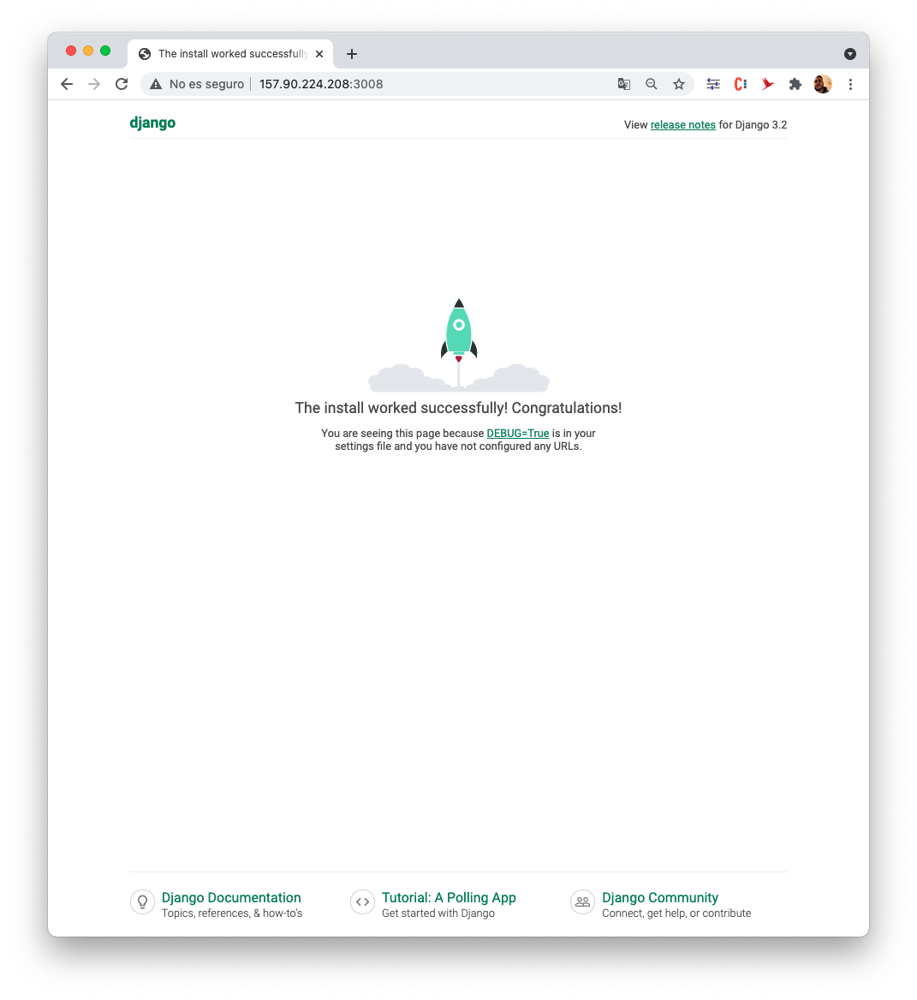

# Tarea 0. Configuración e inicialización del proyecto

Instalamos docker-compose y componemos nuestro primer servicio django

Si vemos lo que hay inicialmente en el directorio:

```bash
pepe@ubuntu-4gb-nbg1-3:~/mii_ssbw$ ls
docker-compose.yml  Dockerfile  README.md  requirements.txt 
```

Una vez ejecutamos 

```bash
docker-compose run web django-admin.py startproject senderos .
```


Podemos ver que tenemos un directorio *senderos* con nuestro proyecto:

```bash
Creating mii_ssbw_web_run ... done
/usr/local/bin/django-admin.py:17: RemovedInDjango40Warning: django-admin.py is deprecated in favor of django-admin.
  warnings.warn(
pepe@ubuntu-4gb-nbg1-3:~/mii_ssbw$ ls
docker-compose.yml  manage.py  requirements.txt
Dockerfile          README.md  senderos
```

Lanzamos el servicio con:

```bash
docker-compose up
```

Y podemos acceder desde fuera con un navegador




# Tarea 1. Bases de Datos NoSQL, ORMs

Teniendo en cuenta que queremos desplegar luego la app, vamos a usar directamente un servicio de base de datos autogestionado basado en NoSQL, que es MongoAtlas. Como ya he montado Mongo como contenedor muchas veces anteriores, esta parte la delego en un servicio y es más cómodo desplegar luego.