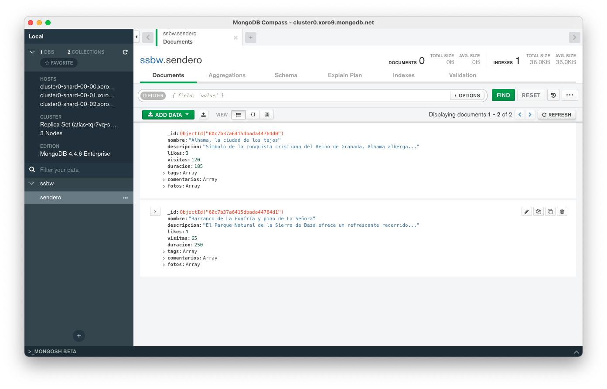
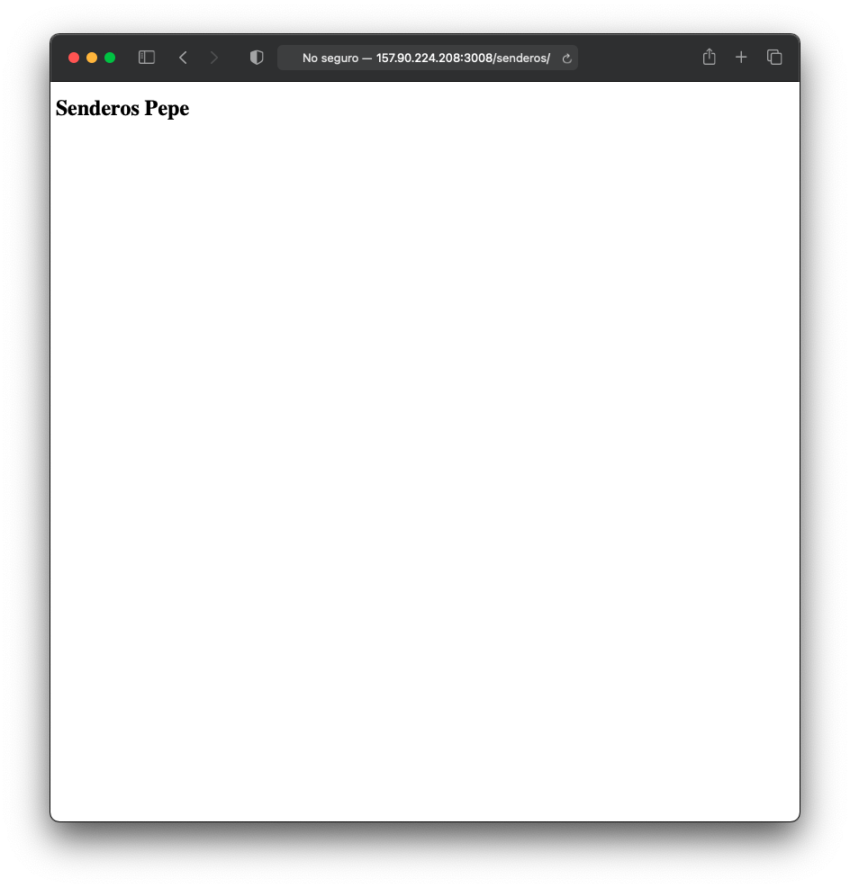
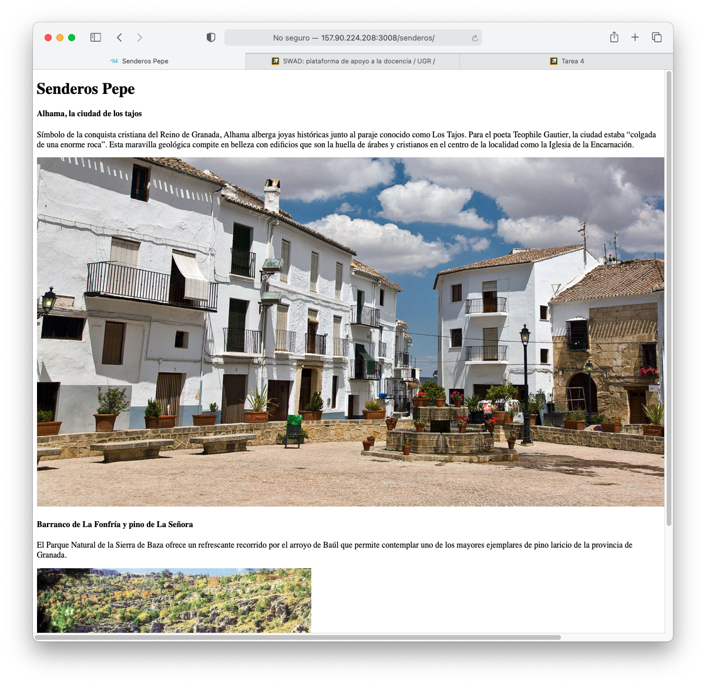
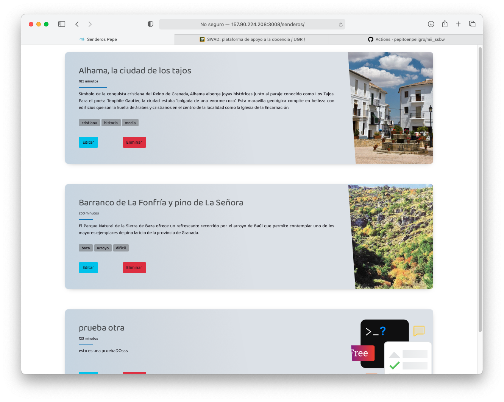
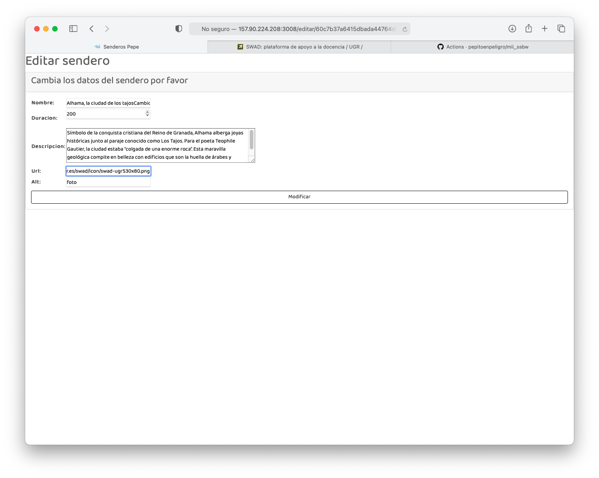
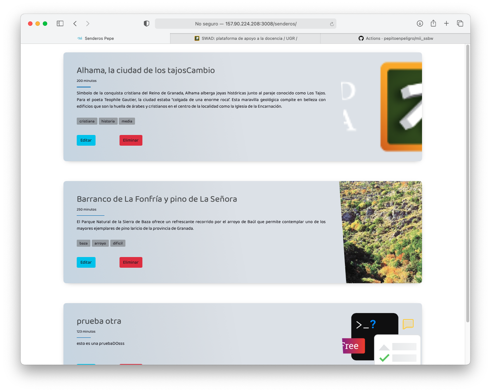
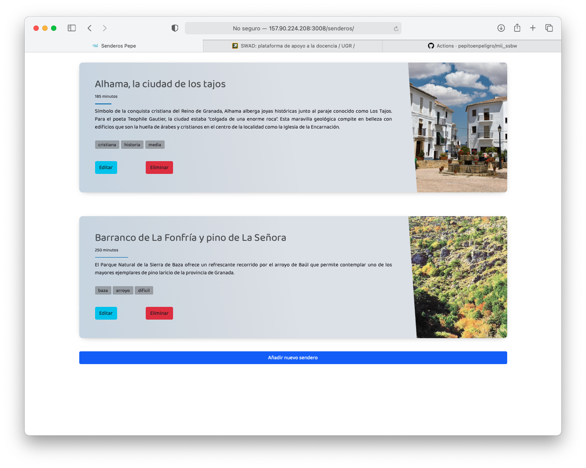

# Demo App

## Likes and Night Mode
https://user-images.githubusercontent.com/14912971/124291600-035c0f00-db55-11eb-8025-fd3dde81abda.mp4

## Login CRUD and Staff
https://user-images.githubusercontent.com/14912971/124291597-022ae200-db55-11eb-9c80-a4ae40a43432.mp4

## React SPA
https://user-images.githubusercontent.com/14912971/124291589-00f9b500-db55-11eb-8c27-00e3ca276cc9.mp4


*If videos are not available, please check _videos_ folder*


# Tarea 0. Configuración e inicialización del proyecto

Instalamos docker-compose y componemos nuestro primer servicio django

Si vemos lo que hay inicialmente en el directorio:

```bash
pepe@ubuntu-4gb-nbg1-3:~/mii_ssbw$ ls
docker-compose.yml  Dockerfile  README.md  requirements.txt 
```

Una vez ejecutamos 

```bash
docker-compose run web django-admin.py startproject senderos .
```


Podemos ver que tenemos un directorio *senderos* con nuestro proyecto:

```bash
Creating mii_ssbw_web_run ... done
/usr/local/bin/django-admin.py:17: RemovedInDjango40Warning: django-admin.py is deprecated in favor of django-admin.
  warnings.warn(
pepe@ubuntu-4gb-nbg1-3:~/mii_ssbw$ ls
docker-compose.yml  manage.py  requirements.txt
Dockerfile          README.md  senderos
```

Lanzamos el servicio con:

```bash
docker-compose up
```

Y podemos acceder desde fuera con un navegador


# Tarea 1. Bases de Datos NoSQL, ORMs

Teniendo en cuenta que queremos desplegar luego la app, vamos a usar directamente un servicio de base de datos autogestionado basado en NoSQL, que es MongoAtlas. Como ya he montado Mongo como contenedor muchas veces anteriores, esta parte la delego en un servicio y es más cómodo desplegar luego.





# Tarea 2. Django

Ajustamos las rutas de los archivos de plantilla (estructura MTV) y de ficheros estáticos.

```python
TEMPLATES = [
    {
        'BACKEND': 'django.template.backends.django.DjangoTemplates',
        'DIRS': [os.path.join(BASE_DIR, 'templates')],
        'APP_DIRS': True,
        'OPTIONS': {
            'context_processors': [
                'django.template.context_processors.debug',
                'django.template.context_processors.request',
                'django.contrib.auth.context_processors.auth',
                'django.contrib.messages.context_processors.messages',
            ],
        },
    },
]

STATICFILES_DIRS = [os.path.join(BASE_DIR, 'static')]
```

Añadimos una nueva ruta:

```python
def senderos_home(request):
    context = {}
    return render(request, 'index.html', context)
```


Probamos que la ruta senderos funciona y renderiza nuestra primera plantilla.



# Tarea 3. CSS y estructura básica

Iniciamos la recuperación de los datos de cada uno de los senderos mostrando la imagen de cada una de ellas. Tenemos que mejorar el diseño con CSS



El autor del diseño de las cartas de los senderos es: https://codepen.io/3psy0n/pen/LYpajmX


# Tarea 4. Formularios y CRUD
Se ha habilitado dos botones dentro de cada tarjeta para poder editar y eliminar. Además se ha agregado un botón más para poder añadir un nuevo sendero al sistema.









# Tarea 5. Autentificación, autorización y registro de eventos 

